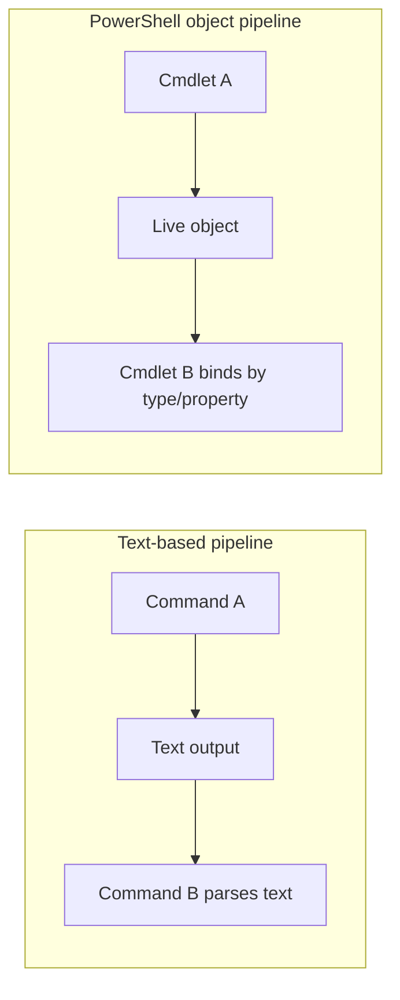

# 3. The Object Pipeline

The pipeline is PowerShell's defining feature and the mechanism that makes it fundamentally different from every other shell. While Bash, Zsh, and cmd.exe pipe plain text from one program's standard output to another's standard input, PowerShell pipes live .NET objects—complete with their properties, methods, and type information—from one command to the next. This distinction transforms the shell from a simple command executor into a powerful object manipulation and composition environment.

When you chain commands together in PowerShell, you are not concatenating strings or parsing column-delimited output. You are passing structured data through a series of transformations, each operating on the objects' actual properties rather than their text representations. This preserves fidelity, eliminates brittle parsing, and enables commands to collaborate in ways their authors never explicitly anticipated.

Understanding the pipeline is essential to mastering PowerShell. Nearly every effective PowerShell script or module relies on passing objects between commands, filtering them based on properties, transforming them through calculations, and aggregating them into reports or actions. The pipeline is both the conceptual foundation and the practical workhorse of PowerShell automation.

## Prereqs

- Chapter 1 concepts: discovery cmdlets, basic command syntax, and object-first thinking
- Chapter 2 concepts: types, calculated properties, and variable scope fundamentals
- A working PowerShell session (`powershell.exe` or `pwsh`) for interactive examples

## Learning Outcomes

- Explain how PowerShell streams objects through the pipeline
- Predict parameter binding by value vs. by property name
- Use `ForEach-Object`, `Where-Object`, `Select-Object`, and `Tee-Object` correctly in streaming pipelines
- Recognize blocking vs. streaming pipeline stages and the performance implications
- Diagnose pipeline behavior with `Trace-Command`
- Build a multi-step pipeline workflow while preserving the properties needed for later stages

## Key Terms

pipeline, parameter binding, ByValue, ByPropertyName, streaming, blocking cmdlet, calculated property, `$_`, `Trace-Command`

## Example Labels

- `<!-- Illustrative -->`: concept-focused examples that may need adaptation for your environment
- `<!-- Tested on: ... -->`: examples validated on a specific PowerShell/runtime version

## 3.1 Pipeline Theory

At its core, PowerShell's pipeline is a stream processing architecture. Commands do not wait for their predecessors to complete and return all data before starting; instead, they process objects one at a time as they arrive. This streaming model keeps memory usage constant regardless of dataset size and allows operations to begin producing output immediately.

<!-- Illustrative -->


The pipeline connects the output stream of one command to the input stream of the next using parameter binding—a sophisticated matching system that determines which parameters should receive which objects and properties. Understanding parameter binding is the key to predicting how pipelines will behave and to designing commands that work seamlessly with others.

Each command in a pipeline typically implements three phases: a `Begin` block that runs once before any input arrives, a `Process` block that executes once for each incoming object, and an `End` block that runs once after all input has been processed. This structure is fundamental to how PowerShell achieves streaming behavior without loading entire datasets into memory.

### 3.1.1 Text vs. Objects: The Unix vs. PowerShell Paradigm

The fundamental philosophical difference between PowerShell and Unix-style shells is what flows through the pipeline. Unix pipes transport bytes formatted as text, relying on each command to parse and understand the format of its input. PowerShell pipes transport structured objects with well-defined types, properties, and methods that are known to both the sending and receiving commands.

This difference manifests in practical ways every time you chain commands together. Consider the task of finding the five largest files in a directory and displaying their sizes in megabytes:

<!-- Illustrative -->
```powershell
# Bash approach
ls -lh | tail -n +2 | sort -k5 -h -r | head -5 | awk '{print $9, $5}'

# PowerShell approach
Get-ChildItem | 
    Where-Object {-not $_.PSIsContainer} |
    Sort-Object Length -Descending |
    Select-Object -First 5 Name, @{n='SizeMB';e={$_.Length/1MB}}
```

Here we see a clear example of the paradigm difference in action. The Bash command relies on text parsing (skipping the header line, assuming size is in column 5, hoping the file names don't contain spaces), while PowerShell operates on actual `FileInfo` objects with typed `Length` properties. No parsing is required, no assumptions about text format are made, and the calculation `Length/1MB` works on the actual numeric value.

| Aspect | Unix Text Pipes | PowerShell Object Pipes |
| --- | --- | --- |
| Data type | Unstructured text (bytes) | Structured .NET objects |
| Type information | Lost; inferred from text format | Preserved with full type metadata |
| Property access | Column parsing (awk, cut) | Direct property reference ( .Name ) |
| Sorting | String-based unless converted | Type-aware (numeric, date, string) |
| Error handling | Text containing errors | Exception objects with full context |
| Localization | Output format may change by locale | Properties remain consistent |
| Discovery | Manual ( man  pages, trial & error) | Get-Member shows all properties |

#### 3.1.1.1 Serialization vs. Live Objects

In text-based shells, every command that produces output must serialize its data into a text representation. The next command in the pipeline must then deserialize (parse) that text back into a usable structure if it wants to perform any meaningful operations. This serialize-parse cycle happens at every pipeline boundary, and each cycle introduces opportunities for data loss, formatting ambiguity, and parsing errors.

PowerShell sidesteps this problem by passing objects directly from memory to memory. When `Get-Process` emits a process object, that object travels down the pipeline as a reference to an actual `System.Diagnostics.Process` instance, not as a text description of a process. The next command receives a pointer to the same object and can call its methods, read its properties, or pass it along unchanged.

Let's examine this difference in concrete terms:

**Loss of fidelity in text streams (Unix)**

When data is serialized to text, richness is inevitably lost. A `DateTime` becomes a string like `"2024-01-15 14:30:00"`, and the receiving command must guess the format and parse it back into a date if it wants to perform date arithmetic. A floating-point number becomes `"3.14159"`, losing any distinction between `Single`, `Double`, and `Decimal` types. Null values, empty strings, and whitespace-only strings all potentially become indistinguishable.

Consider this Bash example:
<!-- Illustrative -->
```bash
ls -l | grep "^-" | awk '{print $9, $5}'
```
The size ($5) is a string. If you want to sum file sizes, you must parse that string into a number, handle potential units (K, M, G), and hope the format never changes. If a filename contains spaces, the field splitting breaks entirely.

**Preservation of methods and types (PowerShell)**

PowerShell objects retain their full type information and methods as they move through the pipeline. A `FileInfo` object knows it is a `FileInfo`, and you can call methods like `.MoveTo()` or `.Delete()` directly:

<!-- Illustrative -->
```powershell
Get-ChildItem -Filter *.tmp |
    Where-Object LastWriteTime -lt (Get-Date).AddDays(-7) |
    ForEach-Object { $_.Delete() }
```

The `LastWriteTime` property is a real `DateTime` object, so the comparison with `AddDays(-7)` works as native date arithmetic. The `.Delete()` method is callable because the object is a genuine `FileInfo` instance with all the behaviors the .NET Framework gave it.

This preservation extends to complex nested structures:
<!-- Illustrative -->
```powershell
Get-Process | 
    Select-Object Name, @{n='ThreadCount';e={$_.Threads.Count}} |
    Where-Object ThreadCount -gt 50
```
The `Threads` property is a collection of `ProcessThread` objects, and accessing `.Threads.Count` works because the object structure is fully intact.

#### 3.1.1.2 The Envelope

Every object that flows through a PowerShell pipeline is wrapped in a `PSObject` envelope. This wrapper is transparent most of the time, but it plays a critical role in PowerShell's extensibility and formatting system. The `PSObject` wrapper allows PowerShell to add properties and methods to objects without modifying their underlying .NET types—a capability essential for adapting arbitrary .NET objects to shell-friendly behaviors.

When you use `Add-Member` to attach a `NoteProperty` or `ScriptProperty` to an object, you are actually modifying its `PSObject` wrapper, not the underlying .NET object. When the formatting system decides how to display an object, it consults type data files (`.ps1xml`) that define custom views, and those views are implemented through the `PSObject` layer.

<!-- Illustrative -->
```powershell
# Example of adding a property to an object
$file = Get-ChildItem | Select-Object -First 1
$file | Add-Member -MemberType NoteProperty -Name 'IsLarge' -Value $false

# View the PSObject wrapper
$file.PSObject | Get-Member
```

Common use cases for the wrapper include:
- Adding calculated properties: `Select-Object @{n='SizeKB';e={$_.Length/1KB}}`
- Tagging objects with metadata: `Add-Member -NoteProperty 'Source' 'ServerA'`
- Controlling display: Custom `Format.ps1xml` files define table and list views
- Cross-platform adaptation: The wrapper hides differences between Windows and Linux .NET APIs

The PSObject wrapper is created automatically whenever an object enters the PowerShell pipeline. If the object is a raw .NET type like `System.IO.FileInfo`, PowerShell wraps it in a `PSObject` and adds any extended properties or methods defined for that type in the loaded type data files.

You can inspect the wrapper directly:
<!-- Illustrative -->
```powershell
$file = Get-ChildItem | Select-Object -First 1
$file.PSObject | Get-Member
```

This reveals members like `Properties`, `Methods`, `TypeNames`, and `BaseObject`. The `BaseObject` property gives you access to the original .NET object if you need to bypass the wrapper for some reason.
For a deeper treatment of custom object design and extension patterns built on this wrapper, see Chapter 17 (Creating Custom Objects).

### 3.1.2 Passing Objects ByValue

The first and most common form of pipeline parameter binding is ByValue, where PowerShell matches objects to parameters based on their types. When an object flows down the pipeline, the parameter binder examines it and asks, "Does the next command have a parameter that accepts this type of object?" If so, the object is bound to that parameter and the command executes.

This type-based matching enables powerful composition. If `Get-Process` emits `Process` objects and `Stop-Process` accepts `Process` objects via its `-InputObject` parameter, you can chain them together without any additional glue:

<!-- Illustrative -->
```powershell
Get-Process -Name notepad | Stop-Process
```

The binder sees that `Stop-Process` has a parameter accepting `Process` objects from the pipeline, matches the incoming objects to that parameter, and invokes `Stop-Process` once for each incoming process. This happens automatically, with no explicit parameter specification required.

Key characteristics of ByValue binding:
- Type-driven: Matches based on the object's .NET type
- Implicit: No need to specify parameter names in the pipeline
- Exact or coercible: Accepts exact type matches or types that can be converted
- First match wins: If multiple parameters accept the type, the first eligible parameter binds
- Common with `-InputObject`: Many cmdlets use this parameter name for ByValue binding

Let's examine the binding process in more detail:

<!-- Illustrative -->
```powershell
# Example showing ByValue binding in action
Get-Process -Name notepad | Stop-Process
```

1. The `Get-Process` cmdlet outputs `Process` objects
2. The pipeline passes these objects to `Stop-Process`
3. The `Stop-Process` cmdlet has a parameter named `-InputObject` marked with `[Parameter(ValueFromPipeline=$true)]`
4. The parameter binder checks if any parameters accept the `Process` type
5. Since `-InputObject` is marked with `ValueFromPipeline=$true`, it binds to the incoming objects
6. `Stop-Process` is invoked once for each process object

#### 3.1.2.1 Type Matching

Type matching is the decision process the parameter binder uses to determine whether an incoming object can be bound to a parameter. The binder first checks for an exact type match: if the incoming object is a `FileInfo` and the parameter expects `FileInfo`, binding succeeds immediately.

If no exact match exists, the binder attempts coercion—converting the incoming type to the parameter type using PowerShell's type conversion system. This allows for flexible pipelines where, for example, you can pass strings to parameters expecting integers (as long as the strings represent valid integers).

<!-- Illustrative -->
```powershell
# Example of type coercion
function Add-Ten {
    param(
        [Parameter(ValueFromPipeline=$true)]
        [int]$Number
    )
    process {
        $Number + 10
    }
}

# This works because "5" can be converted to an integer
"5", "7", "12" | Add-Ten
# Outputs: 15, 17, 22
```

Common successful coercions include:
- String to numeric types (if the string represents a valid number)
- String to `DateTime` (if the string is a valid date format)
- String to `Enum` (if the string matches an enum member name)
- Numeric types widening (Int32 to Int64, Int32 to Double)
- Arrays to single values (taking the first element) in some contexts

#### 3.1.2.2 Binding Process

The parameter binding process occurs in multiple phases, with each phase attempting different binding strategies until either all parameters are satisfied or binding fails. Understanding this process helps you design pipeline-friendly functions and diagnose why certain pipelines don't work as expected.

The binder proceeds roughly in this order:
1. Explicitly named parameters: Any parameters you specify explicitly (e.g., `-ComputerName 'Server01'`)
2. Positional parameters: Parameters bound by position based on the `Position` attribute
3. Pipeline ByValue: Attempts to bind pipeline objects to parameters marked `ValueFromPipeline=$true`
4. Pipeline ByPropertyName: Attempts to match object properties to parameter names
5. Default values: Applies default values to optional parameters if no binding occurred

| Phase | Strategy | When It Applies | Example |
| --- | --- | --- | --- |
| Named | Explicit -ParameterName Value | Always processed first | `Get-Process -Name 'pwsh'` |
| Positional | Parameters by index (Position=0, 1, etc.) | When parameter name omitted | `Get-Process 'pwsh'` |
| ByValue | Type matching from pipeline | Object types match parameter types | `Get-Process | Stop-Process` |
| ByPropertyName | Property names match parameter names | ByValue failed, properties exist | `[PSCustomObject]@{Name='pwsh'} | Get-Process` |
| Defaults | Parameter defaults or $PSDefaultParameterValues | No other binding succeeded | `Get-ChildItem` uses current directory |

**3.1.2.2.1 Checking attribute [ValueFromPipeline]:**

For pipeline binding to work, a parameter must be decorated with the `[Parameter()]` attribute specifying `ValueFromPipeline=$true`:

<!-- Illustrative -->
```powershell
function Test-Pipeline {
    [CmdletBinding()]
    param(
        [Parameter(ValueFromPipeline=$true)]
        [string]$InputObject
    )
    process {
        Write-Output "Received: $InputObject"
    }
}

1..5 | Test-Pipeline
```

Without the `ValueFromPipeline=$true` declaration, objects flowing through the pipeline would not bind to the parameter automatically. The cmdlet would execute once with no input, rather than once per object.

You can inspect which parameters accept pipeline input using `Get-Command`:
<!-- Illustrative -->
```powershell
(Get-Command Stop-Process).Parameters['InputObject'].Attributes | 
    Where-Object {$_ -is [Parameter]}
```

This shows the `Parameter` attribute's properties, including `ValueFromPipeline` and `ValueFromPipelineByPropertyName`.

**3.1.2.2.2 Generic List unrolling in the pipeline:**

When you pipe a collection to a command, PowerShell unrolls the collection, sending each element individually through the `Process` block:

<!-- Illustrative -->
```powershell
$list = [System.Collections.Generic.List[string]]::new()
$list.Add("One")
$list.Add("Two")
$list.Add("Three")

$list | ForEach-Object { "Item: $_" }
# Outputs:
# Item: One
# Item: Two
# Item: Three
```

This unrolling behavior is fundamental to pipeline processing. It means that piping an array of 100 process objects to `Stop-Process` results in `Stop-Process` executing 100 times—once per process—not once with all 100 processes in an array.

However, this behavior can be suppressed when needed. If a parameter explicitly expects an array type and is not marked for pipeline input, the entire collection passes as a single object:

<!-- Illustrative -->
```powershell
function Show-Array {
    param([string[]]$Items)
    "Received $($Items.Count) items"
}

Show-Array -Items ("A","B","C")  # "Received 3 items"
```

Understanding unrolling is critical for predicting pipeline behavior and designing functions that process collections correctly.

One subtlety: strings are enumerable collections of characters. Piping a string (not an array of strings) will send one character at a time down the pipeline. Wrap single strings in an array (`@("literal")`) when you want to treat them as whole units.

### 3.1.3 Passing Objects ByPropertyName

When ByValue binding fails—when the incoming object's type does not match any parameter expecting pipeline input—PowerShell attempts a second strategy: ByPropertyName binding. Instead of matching types, it matches the names of properties on the incoming object to the names of parameters on the receiving command.

This mechanism enables powerful data-driven pipelines where custom objects act as "driving data" for commands. You can create objects with specific property names designed to map onto a command's parameters, effectively building configuration records that the pipeline transforms into executed commands.

For example:

<!-- Illustrative -->
```powershell
$config = [PSCustomObject]@{
    Name = 'pwsh'
}

$config | Get-Process
```

Here `Get-Process` does not accept `PSCustomObject` by type, so ByValue binding fails. However, the `$config` object has a property named `Name`, and `Get-Process` has a parameter with that same name. PowerShell binds the property to the parameter automatically, effectively calling `Get-Process -Name 'pwsh'`.

ByPropertyName binding characteristics:
- Name-driven: Matches property names to parameter names (case-insensitive)
- Falls back from ByValue: Only tried if ByValue binding fails
- Works with any object: As long as property names match parameter names
- Honors aliases: Parameter aliases and property aliases both participate in matching
- Common with CSV imports: Importing CSV creates objects with column-name properties that drive cmdlets

#### 3.1.3.1 Property Name Matching

For ByPropertyName binding to succeed, three conditions must be met:
1. The parameter must be marked with `[Parameter(ValueFromPipelineByPropertyName=$true)]`
2. The incoming object must have a property whose name matches the parameter name (case-insensitive)
3. The property's value must be convertible to the parameter's type

When these conditions align, PowerShell reads the property value from the incoming object and passes it to the parameter, just as if you had typed it explicitly on the command line.

**3.1.3.1.1 Alias matching on properties:**

PowerShell extends ByPropertyName binding to include parameter aliases. If a parameter declares an alias, the binder will match properties with that alias name as well:

<!-- Illustrative -->
```powershell
function Show-Computer {
    [CmdletBinding()]
    param(
        [Parameter(ValueFromPipelineByPropertyName=$true)]
        [Alias('CN','MachineName')]
        [string]$ComputerName
    )
    process {
        "Computer: $ComputerName"
    }
}

[PSCustomObject]@{ CN = 'Server01' } | Show-Computer
# Outputs: Computer: Server01
```

Here the property `CN` matches the parameter alias `CN`, even though the actual parameter name is `ComputerName`. This flexibility makes it easier to integrate with data sources that use abbreviated or alternate naming conventions.

**3.1.3.1.2 Case-insensitive mapping:**

Property name matching is case-insensitive, following PowerShell's general philosophy of forgiving user input:

<!-- Illustrative -->
```powershell
[PSCustomObject]@{
    NAME = 'PWSH'
} | Get-Process
```

The property `NAME` successfully binds to `-Name` despite the case difference. This reduces friction when working with data from external systems that may use different casing conventions.

#### 3.1.3.2 The "Hitchhiker" Pattern

A common advanced pattern is to create custom objects specifically to "drive" downstream commands via ByPropertyName binding. These objects act as configuration records or action plans that the pipeline transforms into executed commands.

**3.1.3.2.1 Creating custom objects to drive parameters:**

Consider a scenario where you need to drive a custom maintenance function with pipeline input records (for example, a wrapper that handles remote execution and timeouts):

<!-- Illustrative -->
```powershell
$actions = @(
    [PSCustomObject]@{ ComputerName = 'Server01'; Name = 'Spooler'; Timeout = 30 }
    [PSCustomObject]@{ ComputerName = 'Server02'; Name = 'W3SVC'; Timeout = 60 }
    [PSCustomObject]@{ ComputerName = 'Server03'; Name = 'WinRM'; Timeout = 45 }
)

$actions | ForEach-Object {
    "Would restart {0} on {1} with timeout {2}s" -f $_.Name, $_.ComputerName, $_.Timeout
}
```

While this example uses explicit property references, you could design your own function to accept these objects via ByPropertyName, eliminating the need for the `ForEach-Object`:

<!-- Illustrative -->
```powershell
function Restart-ServiceAdvanced {
    [CmdletBinding()]
    param(
        [Parameter(ValueFromPipelineByPropertyName=$true)]
        [string]$ComputerName,
        
        [Parameter(ValueFromPipelineByPropertyName=$true)]
        [string]$Name,
        
        [Parameter(ValueFromPipelineByPropertyName=$true)]
        [int]$Timeout = 30
    )
    process {
        # Restart service logic here
        [PSCustomObject]@{
            ComputerName = $ComputerName
            Name         = $Name
            Timeout      = $Timeout
            Action       = 'Restart-Service'
            Status       = 'Planned'
        }
    }
}

$actions | Restart-ServiceAdvanced
```

Now the custom objects drive the command entirely through the pipeline, with no manual property extraction required.

**3.1.3.2.2 Calculated properties to align names:**

Sometimes the properties on your objects don't quite match the parameter names of the commands you want to call. Use `Select-Object` with calculated properties to rename them on the fly:

<!-- Illustrative -->
```powershell
$computers = Get-ADComputer -Filter {Name -like 'SRV*'} |
    Select-Object @{n='ComputerName';e={$_.Name}}, DistinguishedName

$computers | Invoke-Command -ScriptBlock { Get-Service }
```

Here Active Directory returns computers with a `Name` property, but `Invoke-Command` expects `-ComputerName`. The calculated property `@{n='ComputerName';e={$_.Name}}` creates a new property with the correct name, enabling ByPropertyName binding to succeed.

This technique is essential when integrating data from diverse sources where property names don't align perfectly with cmdlet parameters.

### 3.1.4 The Trace-Command Utility for Pipeline Debugging

When pipelines don't work as expected—when objects don't bind to parameters or when errors occur mysteriously—the solution is often to trace the parameter binding process. `Trace-Command` exposes PowerShell's internal decision-making, showing you exactly which binding strategies succeeded or failed and why.

This is the single most valuable debugging tool for understanding pipeline behavior. While `Get-Member` (introduced in Chapter 2) tells you what properties an object has, and `Get-Command` tells you what parameters a cmdlet accepts, only `Trace-Command` shows you the live binding decisions PowerShell makes as it processes your pipeline.

<!-- Tested on: Windows 11 + PowerShell 7.4 -->
```powershell
Trace-Command -Name ParameterBinding -Expression {
    Get-Process -Name powershell | Stop-Process -WhatIf
} -PSHost
```

This command traces the parameter binding for the entire pipeline, showing attempts at ByValue binding, ByPropertyName binding, type coercions, and eventual successes or failures.

#### 3.1.4.1 ParameterBinding Trace Source

The `ParameterBinding` trace source captures the internal dialogue of the parameter binder as it processes each parameter and incoming object. The output is verbose but structured, following a predictable pattern for each binding attempt.

**3.1.4.1.1 Viewing the binding decision tree:**

A typical trace shows the binder working through parameters in order, checking each one against binding rules:

<!-- Illustrative -->
```text
BIND NAMED cmd line args [Stop-Process]
BIND arg [powershell] to parameter [Name]
BIND POSITIONAL cmd line args [Stop-Process]
BIND PIPELINE object to parameters: [Stop-Process]
  PIPELINE object TYPE = [System.Diagnostics.Process]
  BIND PIPELINE obj to parameter [InputObject]
    SUCCESS: Parameter [InputObject] PIPELINE INPUT ValueFromPipeline
```

This trace reveals the binder's decision process: it processed named parameters first, moved to pipeline binding, identified the pipeline object type, found a matching parameter, and successfully bound the object. When binding fails, the trace shows which strategies were attempted and where they failed.

**3.1.4.1.2 Identifying coercion failures:**

Type coercion failures appear as explicit messages in the trace:

<!-- Illustrative -->
```text
COERCE arg to [System.Int32]
  ERROR: Cannot convert "abc" to "System.Int32"
```

This tells you that PowerShell attempted to convert the string `"abc"` to an integer and failed. Common coercion failures include strings that don't represent valid numbers, dates in ambiguous formats, property values of incompatible types, and arrays passed to parameters expecting single values.

#### 3.1.4.2 Interpreting Trace Output

Trace output follows consistent patterns. Key phrases to look for include:
- "BIND arg to parameter": Named or positional parameter binding
- "PIPELINE object TYPE": The type of object entering the pipeline
- "SUCCESS": Binding succeeded for this parameter
- "BIND failed": Binding failed; binder will try other strategies
- "COERCE": Attempting type conversion
- "MANDATORY parameter": Required parameter not yet bound
- "LEFTOVER": Unbound arguments that couldn't match any parameter

**3.1.4.2.1 MANDATORY vs OPTIONAL checks:**

The binder handles mandatory and optional parameters differently. Mandatory parameters must be bound before the cmdlet can execute, so the binder will exhaust all strategies (named, positional, pipeline) before failing. Optional parameters are bound opportunistically—if binding works, the parameter is set; if not, it keeps its default value and execution continues.

In traces, you'll see messages like:
<!-- Illustrative -->
```text
MANDATORY NAMED parameter [ComputerName] is not set
BIND POSITIONAL args to MANDATORY parameter [ComputerName]
```

This indicates the binder is trying multiple strategies to satisfy a required parameter.

**3.1.4.2.2 Pipeline inputs classification:**

The trace explicitly identifies whether objects come from the pipeline or from explicit arguments:

<!-- Illustrative -->
```text
PIPELINE INPUT object
EXPLICIT ARGUMENT object
```

This distinction determines which binding strategies apply. Explicit arguments bind via name or position; pipeline objects bind via ByValue or ByPropertyName. Understanding this classification helps explain why a command behaves differently when you pass objects explicitly versus through the pipeline.

### 3.1.5 Pipeline Stalls and Buffer Management

PowerShell's streaming pipeline architecture is highly efficient, but not all cmdlets stream their data immediately. Some commands—particularly those that need to examine the entire dataset before producing output—must buffer all incoming objects before they can emit results. Understanding which cmdlets block the pipeline and why is essential for writing performant scripts and predicting memory usage.

A pipeline "stalls" when a cmdlet in the chain cannot pass objects downstream until it has received all upstream input. This blocking behavior transforms a constant-memory streaming operation into one that must hold the entire dataset in memory simultaneously.

#### 3.1.5.1 Streaming vs. Blocking Cmdlets

Streaming cmdlets process objects one at a time and immediately pass results downstream. Blocking cmdlets must collect all input before they can produce any output. The distinction determines both performance characteristics and memory footprint.

| Cmdlet Type | Examples | Behavior | Memory Usage |
| --- | --- | --- | --- |
| Streaming | Where-Object, ForEach-Object, Select-Object (no -First / -Last) | Process and emit immediately | O(1) per object |
| Blocking | Sort-Object, Group-Object, Measure-Object | Collect all input, then emit | O(n) for entire dataset |
| Conditional Blocking | Select-Object -Last, Get-Content -Tail | Block only when necessary | Varies by parameters |

**3.1.5.1.1 How Sort-Object blocks the pipe:**

`Sort-Object` is the quintessential blocking cmdlet. It cannot emit the first sorted object until it has received the last unsorted object, because it doesn't know what order to use until the entire dataset is available:

<!-- Illustrative -->
```powershell
Get-ChildItem -Recurse | Sort-Object Length -Descending | Select-Object -First 10
```

In this pipeline:
- `Get-ChildItem` starts streaming file objects immediately
- `Sort-Object` collects every single file into memory
- Only after Get-ChildItem finishes does Sort-Object sort the entire collection
- Sort-Object then streams the sorted results to Select-Object
- `Select-Object -First 10` stops after 10 objects

The memory usage equals the size of all file objects multiplied by the total file count. For a directory tree with millions of files, this can exhaust available memory.

**3.1.5.1.2 How Get-Content -ReadCount affects buffers:**

`Get-Content` streams by default, emitting one line at a time. The `-ReadCount` parameter lets you batch lines for more efficient downstream processing:

<!-- Illustrative -->
```powershell
Get-Content largefile.txt -ReadCount 100 | ForEach-Object {
    # $_ is now an array of 100 lines
    Process-Batch $_
}
```

Without `-ReadCount`, the Process block executes once per line (potentially millions of times). With `-ReadCount 100`, it executes once per hundred lines, reducing overhead. This is particularly valuable when the per-invocation cost of the downstream cmdlet is high.

#### 3.1.5.2 Memory Pressure

When pipelines process large datasets, memory pressure becomes a concern. Blocking cmdlets hold entire collections in memory, and even streaming cmdlets accumulate memory if downstream processing is slow.

**3.1.5.2.1 Large dataset accumulation in blocking commands:**

Blocking commands store the entire dataset in RAM before processing. If you pipe 10GB of log data through `Sort-Object`, PowerShell will attempt to load all 10GB into memory simultaneously. On systems with insufficient RAM, this leads to swapping (severe performance degradation) or OutOfMemory exceptions (process termination).

Mitigation strategies include:
- Limit input early: Use `-Filter` or `Where-Object` to reduce data volume before blocking cmdlets
- Process in chunks: Break large datasets into manageable pieces
- Use alternative approaches: For grouping, consider hashtables instead of `Group-Object`
- Monitor memory: Use Task Manager or `Get-Process` to watch memory consumption

**3.1.5.2.2 OutOfMemory exceptions in pipelines:**

OutOfMemory exceptions in pipelines typically manifest as:
<!-- Illustrative -->
```text
Exception of type 'System.OutOfMemoryException' was thrown.
```

Common troubleshooting scenarios:
- Sorting millions of log entries without filtering first
- Grouping large datasets with many unique keys
- Using `Measure-Object` on properties that are themselves large objects
- Recursive directory enumeration on network shares with millions of files

The solution is usually to restructure the pipeline to filter early, process in batches, or avoid blocking cmdlets entirely by using streaming alternatives.

## 3.2 Iteration in the Pipeline

Iteration—processing multiple items one by one—is fundamental to pipeline-based scripting. PowerShell offers two primary iteration mechanisms: the `ForEach-Object` cmdlet for pipeline-based iteration and the `foreach` statement for traditional loop-based iteration. Understanding when to use each approach and how they differ in performance and behavior is key to writing efficient, idiomatic PowerShell.

The pipeline approach to iteration has both advantages and costs. It enables streaming (constant memory usage regardless of dataset size), composability (easy chaining with other cmdlets), and clarity (intent is often more obvious). However, it incurs per-item overhead that can matter for performance-critical loops processing millions of objects.

### 3.2.1 ForEach-Object: The Process Block

`ForEach-Object` (alias `%` or `foreach` in older versions) is the primary iteration cmdlet for pipelines. It executes a script block once for each object flowing through the pipeline, with the current object available in the automatic variable `$_` (or `$PSItem` in PowerShell 3.0+).

Basic usage:
<!-- Illustrative -->
```powershell
Get-Process | ForEach-Object {
    "Process: $($_.Name), CPU: $($_.CPU)"
}
```

This cmdlet is essential for performing actions on pipeline objects that cannot be accomplished with simpler cmdlets like `Where-Object` or `Select-Object`.

#### 3.2.1.1 InputProcessing Method Map

`ForEach-Object` implements the standard cmdlet lifecycle: `Begin`, `Process`, and `End` blocks. When you provide a single script block, it maps to the `Process` block, which executes once per input object.

**3.2.1.1.1 Mapping the scriptblock to ProcessRecord():**

Internally, the script block you provide becomes the body of the `ProcessRecord()` method in the cmdlet's execution model. This means your code runs in a context where:
- `$_` contains the current pipeline object
- Local variables persist across iterations within the same pipeline
- The script block can use control flow (such as `return`) to skip work for the current object
- Errors can be handled with try/catch

<!-- Illustrative -->
```powershell
1..5 | ForEach-Object {
    if ($_ -eq 3) { return } # Skip 3 and keep the pipeline running
    "Processing: $_"
}
```

In `ForEach-Object` script blocks, `return` is the portable way to skip the current input object and keep the pipeline running. Avoid `continue` here: in Windows PowerShell 5.1 (and current `pwsh` behavior), it can terminate the enclosing pipeline unexpectedly.

**3.2.1.1.2 The $_ (or $PSItem) Automatic Variable:**

`$_` is the automatic variable representing the current pipeline object. It exists only within the script block of pipeline cmdlets like `ForEach-Object`, `Where-Object`, and `Switch`.

`$PSItem` is an alias for `$_` introduced in PowerShell 3.0 for better readability, particularly in nested pipelines where multiple levels of `$_` can become confusing:

<!-- Illustrative -->
```powershell
Get-ChildItem | ForEach-Object {
    Get-Content $_ | ForEach-Object {
        # Inner $_ is a line of text
        # Outer $_ (the file) is no longer accessible here
    }
}
```

Using `$PSItem` in such cases can clarify which "current object" you're referring to.

#### 3.2.1.2 Overhead Analysis

`ForEach-Object` incurs overhead for each iteration. This overhead is negligible for dozens or hundreds of objects but becomes measurable when processing millions of items in tight loops.

**3.2.1.2.1 Function invocation cost per item:**

Each iteration of `ForEach-Object` is effectively a function call. PowerShell must:
- Set up the execution context
- Bind `$_` to the current object
- Execute the script block
- Clean up the context
- Repeat for the next object

For a pipeline processing 10 million objects, this happens 10 million times. The cumulative cost can be significant compared to a simple `foreach` statement loop processing millions of items in memory.

<!-- Illustrative -->
```powershell
# ForEach-Object: ~2000ms for 1 million items
Measure-Command {
    1..1000000 | ForEach-Object { $_ * 2 } | Out-Null
}

# foreach statement: ~200ms for 1 million items
Measure-Command {
    $array = 1..1000000
    foreach ($item in $array) { $null = $item * 2 }
}
```

The `foreach` statement is an order of magnitude faster for simple operations. Use `ForEach-Object` when you need pipeline composition; use `foreach` statement when raw speed matters and you already have the collection in memory.

**3.2.1.2.2 Scope creation cost per iteration:**

While not a full scope in the sense of `&`, the script block does create an isolated context where variables can shadow outer scopes. This context creation and teardown adds CPU cycles per iteration.

### 3.2.2 The Begin and End Blocks

`ForEach-Object` supports an extended syntax with separate `Begin`, `Process`, and `End` script blocks. This allows you to perform setup before processing any objects, execute logic for each object, and perform cleanup or aggregation after all objects have been processed:

<!-- Illustrative -->
```powershell
Get-Process | ForEach-Object -Begin {
    $total = 0
} -Process {
    $total += $_.WorkingSet
} -End {
    "Total memory: $($total / 1GB) GB"
}
```

This pattern is particularly useful for aggregation operations, initialization of counters or accumulator variables, and resource cleanup.

#### 3.2.2.1 Initialization Phase (Begin)

The `Begin` block executes exactly once before any pipeline objects are processed. Use it to initialize variables, open connections, or perform setup that should not repeat for each object.

**3.2.2.1.1 Setting up connections or counters:**

Initialize variables or resources that will accumulate or be used across all iterations:

<!-- Illustrative -->
```powershell
$files = Get-ChildItem -Recurse |
    ForEach-Object -Begin {
        $totalSize = 0
        $fileCount = 0
    } -Process {
        $totalSize += $_.Length
        $fileCount++
        $_  # Pass the object downstream
    } -End {
        [PSCustomObject]@{
            TotalFiles = $fileCount
            TotalSizeGB = [math]::Round($totalSize / 1GB, 2)
        }
    }
```

This pattern computes statistics while streaming objects through the pipeline without blocking or collecting them all in memory.

**3.2.2.1.2 Running once before first object:**

The `Begin` block runs exactly once, regardless of whether the pipeline contains zero, one, or one million objects. If the upstream command produces no output, `Begin` still executes, but `Process` never does:

<!-- Illustrative -->
```powershell
Get-Process -Name "DoesNotExist" -ErrorAction SilentlyContinue |
    ForEach-Object -Begin {
        "Begin: This always runs"
    } -Process {
        "Process: This never runs (no input)"
    } -End {
        "End: This also always runs"
    }
```

Output:
<!-- Illustrative -->
```text
Begin: This always runs
End: This also always runs
```

#### 3.2.2.2 Finalization Phase (End)

The `End` block executes exactly once after all pipeline objects have been processed. Use it for final calculations, closing resources, or emitting summary objects.

**3.2.2.2.1 Aggregating results:**

The `End` block is ideal for emitting summary statistics:

<!-- Illustrative -->
```powershell
Get-Process | ForEach-Object -Begin {
    $count = 0
    $cpuSum = 0
} -Process {
    $count++
    $cpuSum += $_.CPU
} -End {
    "Average CPU: $($cpuSum / $count)"
}
```

**3.2.2.2.2 Cleanup resources:**

Always close resources in the `End` block to prevent leaks:

<!-- Illustrative -->
```powershell
Get-Content input.txt | ForEach-Object -Begin {
    $output = [System.IO.StreamWriter]::new("output.txt")
} -Process {
    $output.WriteLine($_.ToUpper())
} -End {
    $output.Close()
}
```

This pattern guarantees the file is closed even if the pipeline is interrupted. Alternatively, use `try/finally` for more robust error handling.

### 3.2.3 Performance: ForEach-Object vs. foreach statement

The choice between `ForEach-Object` and the `foreach` statement is one of the most frequently debated topics in PowerShell performance discussions. The answer depends on your priorities: pipeline composition and streaming versus raw execution speed.

#### 3.2.3.1 Memory Loading

| Aspect | foreach Statement | ForEach-Object |
| --- | --- | --- |
| Data loading | Iterates whatever enumerator provides (may stream) | Streams objects one at a time |
| Memory usage | Depends on source: arrays force all data in memory; deferred enumerables stream | O(1) per object |
| Speed | Faster (optimized native loop) | Slower (cmdlet invocation overhead) |
| Best for | In-memory collections or deferred enumerables when speed matters | Large/infinite streams, composition |

**3.2.3.1.1 Foreach statement loading all to RAM:**

The `foreach` statement iterates over any enumerable. If the enumerable is already materialized (an array or list), the whole collection is in memory; if the enumerable is deferred (for example, an iterator from `Get-ChildItem`), it streams:

<!-- Illustrative -->
```powershell
$data = Get-LargeDataset  # If this returns an array, it's all in memory; iterators may stream
foreach ($item in $data) {
    Process-Item $item
}
```

If `Get-LargeDataset` returns an array of 10 million objects, all 10 million must fit in memory simultaneously. If it returns an iterator that streams results, `foreach` consumes them lazily without buffering the entire set.

**3.2.3.1.2 Pipeline streaming reducing RAM footprint:**

`ForEach-Object` processes objects as they arrive, without accumulating them:
<!-- Illustrative -->
```powershell
Get-LargeDataset | ForEach-Object {
    Process-Item $_
}
```

Memory usage remains constant because each object is processed and discarded before the next arrives. This enables processing datasets larger than available RAM.

#### 3.2.3.2 CPU Cycles

Raw execution speed favors the `foreach` statement by a significant margin:

| Metric | foreach Statement | ForEach-Object |
| --- | --- | --- |
| Execution model | Optimized IL code | Cmdlet invocation per item |
| Overhead per iteration | ~nanoseconds | ~microseconds |
| Relative speed (1M items) | 1x (baseline) | 5-10x slower |

**3.2.3.2.1 Keyword optimization (foreach statement wins):**

The `foreach` statement compiles to optimized IL code with minimal overhead. Each iteration is essentially a pointer increment and bound check—just a few CPU instructions:

<!-- Illustrative -->
```powershell
# foreach: ~200ms for 1 million items
$data = 1..1000000
Measure-Command {
    foreach ($item in $data) { $item * 2 } | Out-Null
}
```

**3.2.3.2.2 Cmdlet overhead (ForEach-Object loses):**

`ForEach-Object` invokes a cmdlet for each object, which includes parameter binding, context creation, and script block execution:

<!-- Illustrative -->
```powershell
# ForEach-Object: ~2000ms for 1 million items
Measure-Command {
    1..1000000 | ForEach-Object { $_ * 2 } | Out-Null
}
```

Summary: Use `ForEach-Object` for streaming large datasets or when pipeline composition improves readability. Use `foreach` statement when speed matters and data fits in memory.

### 3.2.4 Parallel Processing in PowerShell 7+

PowerShell 7 introduced the `-Parallel` parameter for `ForEach-Object`, enabling true parallel processing without requiring background jobs or runspaces. This feature significantly improves performance for CPU-bound or I/O-bound operations that can benefit from concurrency.

> **Windows PowerShell 5.1 vs PowerShell 7+**: `ForEach-Object -Parallel` is available only in PowerShell 7 and later. In Windows PowerShell 5.1, use jobs or runspaces for concurrency (covered later in Chapter 19).

Basic usage:
<!-- Tested on: PowerShell 7.4 -->
```powershell
1..10 | ForEach-Object -Parallel {
    Start-Sleep -Seconds 1
    "Processed $_"
} -ThrottleLimit 5
```

This executes up to 5 iterations simultaneously, reducing total execution time from 10 seconds to ~2 seconds.

#### 3.2.4.1 The -Parallel Parameter

The `-Parallel` parameter runs the script block in separate runspaces, isolated from each other and from the main session.

**3.2.4.1.1 Runspace pool creation:**

Each parallel iteration runs in its own runspace from a pool. Runspaces are lightweight PowerShell execution environments—more efficient than separate processes but more isolated than threads:

<!-- Tested on: PowerShell 7.4 -->
```powershell
1..100 | ForEach-Object -Parallel {
    # This runs in a separate runspace
    # Variables from parent scope are not visible by default
    Get-Process -Id $_
} -ThrottleLimit 10
```

The `-ThrottleLimit` parameter controls how many runspaces execute simultaneously (default is 5).

**3.2.4.1.2 Marshaling objects across runspaces:**

Data passed to parallel script blocks must be serialized and deserialized. Simple types (strings, integers) marshal efficiently, but complex objects incur overhead:

<!-- Tested on: PowerShell 7.4 -->
```powershell
$config = @{Server='SQL01'; DB='Prod'}
1..10 | ForEach-Object -Parallel {
    # $using: scope accesses variables from parent
    Connect-Database -Server $using:config.Server
}
```

The `$using:` scope modifier imports variables from the parent session, but serialization cost can negate performance benefits for small, fast operations.

#### 3.2.4.2 ThrottleLimit Management

Choosing the right throttle limit is critical for performance.

**3.2.4.2.1 CPU core saturation:**

Set `-ThrottleLimit` based on your workload type:
- CPU-bound work: Match physical CPU cores (`$env:NUMBER_OF_PROCESSORS`)
- I/O-bound work (network, disk): Higher limits (20-50) to overlap I/O waits
- Resource-constrained (low memory): Lower limits (2-5) to avoid swapping

Example:
<!-- Tested on: PowerShell 7.4 -->
```powershell
$cores = [Environment]::ProcessorCount
$files | ForEach-Object -Parallel {
    Compress-Archive -Path $_ -DestinationPath "$_.zip"
} -ThrottleLimit $cores
```

**3.2.4.2.2 Managing thread contention:**

Parallel blocks must avoid race conditions when accessing shared resources:

<!-- Tested on: PowerShell 7.4 -->
```powershell
# WRONG: Race condition writing to same file
1..100 | ForEach-Object -Parallel {
    Add-Content shared.log "Processed $_"  # Multiple threads, corrupted output
}

# CORRECT: Use thread-safe collection or separate outputs
1..100 | ForEach-Object -Parallel {
    Add-Content "log_$_.txt" "Processed $_"  # Each thread writes to own file
}
```

For truly shared state, use thread-safe collections from `System.Collections.Concurrent` namespace.

### 3.2.5 Nested Pipelines and Scope

Running a pipeline inside another pipeline loop is a powerful but complex pattern that requires careful understanding of PowerShell's scoping rules and pipeline mechanics. This section explores the intricacies of nested pipelines, their performance characteristics, and how to manage scope when building deeply nested pipeline structures.

#### 3.2.5.1 Variable Visibility

When you nest pipelines with `ForEach-Object`, inner script blocks can read and modify variables from the caller's scope. This is a critical behavior to understand when building complex pipeline-based solutions.

**3.2.5.1.1 Inner pipeline accessing outer variables:**

Inner pipelines can read variables from outer scopes, which is useful for creating context-aware processing:

<!-- Illustrative -->
```powershell
$multiplier = 10
1..5 | ForEach-Object {
    $outer = $_
    1..3 | ForEach-Object {
        # Can read both $outer and $multiplier
        $outer * $_ * $multiplier
    }
}
```

This pattern is particularly useful when building data processing pipelines where each stage needs to know some context established by earlier stages. The output would be:
<!-- Illustrative -->
```text
10
20
30
20
40
60
30
60
90
40
80
120
50
100
150
```

**3.2.5.1.2 Variable modification issues:**

Unlike many Unix shells (where pipeline segments often run in subshells), `ForEach-Object` script blocks in PowerShell run in the caller's scope. That means nested pipeline script blocks can update variables defined outside the pipeline:

<!-- Illustrative -->
```powershell
$count = 0
1..5 | ForEach-Object {
    1..3 | ForEach-Object {
        $count++  # Updates the outer variable
    }
}
# $count is now 15
```

See Chapter 2.4 for a fuller refresher on scope modifiers (`$script:`, parent/child scopes, and `Set-Variable -Scope`).

This behavior is a major advantage of PowerShell's object pipeline over Bash-style subshell pipelines. In ordinary `ForEach-Object` usage, `$count` refers to the same variable across the nested script blocks. (By contrast, `ForEach-Object -Parallel` runs in separate runspaces and does require explicit state-sharing patterns.)

#### 3.2.5.2 Pipeline Depth Limits

Deeply nested pipelines can theoretically hit recursion limits, though this is rare in practice. Understanding these limits helps avoid unexpected failures in complex pipeline structures.

**3.2.5.2.1 Stack overflow considerations:**

PowerShell's call stack has limits (typically thousands of levels deep). Extremely deep pipeline nesting combined with recursive function calls could exhaust the stack:

<!-- Illustrative -->
```powershell
# Pathological case - avoid this pattern
function Recurse {
    param($depth)
    if ($depth -gt 0) {
        1..10 | ForEach-Object { Recurse ($depth - 1) }
    }
}

Recurse 100  # Could cause stack overflow
```

In practice, well-designed pipelines rarely exceed 2-3 levels of nesting. This pattern is problematic for several reasons:
- Each pipeline stage adds a layer to the stack
- Nested `ForEach-Object` calls add additional scope contexts
- Recursion compounds the stack depth exponentially

**3.2.5.2.2 Debugging nested logic:**

Use `Write-Debug` or `Write-Verbose` with descriptive messages to trace execution through nested pipelines:

<!-- Illustrative -->
```powershell
1..3 | ForEach-Object {
    Write-Verbose "Outer: $_"
    1..2 | ForEach-Object {
        Write-Verbose "  Inner: $_"
    }
}
```

Run with `-Verbose` to see the execution flow. For complex nested logic, consider refactoring into separate functions with descriptive names—this improves readability and makes debugging easier.

#### 3.2.5.3 Nested Pipeline Patterns

Several common patterns emerge when working with nested pipelines. Understanding when to use them and when to refactor can significantly improve your script's maintainability and performance.

**3.2.5.3.1 The "Parallel Processing" Pattern:**

While PowerShell 7+ offers `-Parallel` for true parallel execution, you can create similar behavior with nested pipelines:

<!-- Tested on: PowerShell 7.4 -->
```powershell
$jobs = 1..100 | ForEach-Object -Parallel {
    # This runs in its own runspace
    Start-Sleep -Seconds 1
    "Processed $_"
} -ThrottleLimit 20
```

This pattern is particularly useful when:
- You need fine-grained control over parallel execution
- You want to avoid the overhead of creating separate pipeline stages
- You need to combine parallel processing with sequential processing

**3.2.5.3.2 The "Context-Sensitive Processing" Pattern:**

This pattern uses the outer pipeline to establish context that the inner pipeline can use:

<!-- Illustrative -->
```powershell
$sizeThresholdMB = 1
Get-ChildItem -Path $env:TEMP -Directory | ForEach-Object {
    $outerDir = $_
    Get-ChildItem -Path $outerDir.FullName -File -ErrorAction SilentlyContinue |
        Where-Object { $_.Length -gt ($sizeThresholdMB * 1MB) } |
        Select-Object @{n='ParentDirectory';e={$outerDir.Name}}, Name, Length
}
```

The inner pipeline can read variables from the outer scope (`$outerDir`, `$sizeThresholdMB`) without extra plumbing.

**3.2.5.3.3 The "Stateful Processing" Pattern:**

This pattern uses the inner pipeline to maintain state across iterations:

<!-- Illustrative -->
```powershell
$state = [pscustomobject]@{
    TotalCpu = 0
    ProcessCount = 0
}

Get-Process | ForEach-Object {
    $state.ProcessCount++
    $state.TotalCpu += (if ($null -ne $_.CPU) { [double]$_.CPU } else { 0.0 })
    $_ | ForEach-Object -Process {
        # State is maintained across iterations
        $runningAverage = $state.TotalCpu / $state.ProcessCount
        [PSCustomObject]@{
            Name              = $_.Name
            CpuSeconds        = $_.CPU
            RunningAverageCpu = [math]::Round($runningAverage, 2)
        }
    }
}

"Average CPU: $([math]::Round($state.TotalCpu / $state.ProcessCount, 2))"
```

This approach is powerful but can be error-prone if not carefully managed, especially when combined with parallel processing. Prefer emitting annotated objects (as shown) over taking destructive actions inside a teaching example.

#### 3.2.5.4 Performance Implications

Nested pipelines can significantly impact performance due to the overhead of scope creation and pipeline binding. Understanding these implications helps you choose the right approach for your specific use case.

**3.2.5.4.1 Scope Creation Overhead:**

Each pipeline stage creates a new scope, which has performance implications:
- Memory allocation for scope variables
- Context switching overhead
- Increased memory pressure

When nesting pipelines, this overhead compounds:
<!-- Illustrative -->
```powershell
# Outer pipeline (10 items)
1..10 | ForEach-Object {
    # Inner pipeline (100 items)
    1..100 | ForEach-Object {
        # Each inner iteration creates a new scope
    }
}
```

In this example, 1,000 scopes are created, each with its own variable context. This can be particularly problematic in loops that run millions of times.

**3.2.5.4.2 Pipeline Binding Cost:**

Each object in the inner pipeline must be bound to the parameters of the inner command. This binding process:
- Checks parameter types
- Performs type coercion if needed
- Handles ByValue and ByPropertyName binding

When nesting pipelines, this binding process is repeated for every object at each level.

**3.2.5.4.3 Memory Pressure Analysis:**

Nested pipelines can create significant memory pressure when:
- Processing large datasets
- Maintaining state across iterations
- Using complex objects with many properties

Consider the following comparison:
<!-- Illustrative -->
```powershell
# Single pipeline (more efficient)
Get-Process | Where-Object { $_.CPU -gt 10 } | 
    ForEach-Object { $_.Kill() }

# Nested pipeline (more memory intensive)
Get-Process | ForEach-Object {
    # Outer context
    $_ | Where-Object { $_.CPU -gt 10 } | 
        ForEach-Object { $_.Kill() }
}
```

The nested version creates more scope objects and has more binding operations, potentially causing higher memory usage.

#### 3.2.5.5 Best Practices for Nested Pipelines

To minimize performance issues and avoid common pitfalls, follow these best practices:

**3.2.5.5.1 Avoid Deep Nesting:**

Generally, keep nesting to 2-3 levels. For deeper structures:
- Consider refactoring into separate functions
- Use variable caching to avoid repeated pipeline processing
- Use the `Begin`/`Process`/`End` blocks effectively

**3.2.5.5.2 Use Script Variables for State:**

When maintaining state across iterations:
- Prefer local variables initialized in `Begin` for per-pipeline state
- Use `$script:` only when you intentionally need state to outlive the current pipeline invocation
- Avoid accessing outer variables in the inner pipeline for performance reasons

**3.2.5.5.3 Use Parallel Processing Where Appropriate:**

For CPU-bound tasks:
- Use `-Parallel` in PowerShell 7+ instead of nested pipelines
- For I/O-bound tasks, consider using the `Start-Job` cmdlet

**3.2.5.5.4 Consider Pipeline Optimization:**

When working with nested pipelines:
- Check if you can filter early in the pipeline
- Look for opportunities to reduce the number of objects flowing through the inner pipeline
- Prefer assigning the outer value to a clearly named local variable (for example, `$outer = $_`) and reading it inside the inner pipeline; reserve `$using:` for remoting and `ForEach-Object -Parallel` scenarios

**3.2.5.5.5 Use `ForEach-Object -Begin` for Initialization:**

If you need to initialize state in the outer pipeline:
<!-- Illustrative -->
```powershell
Get-Process | ForEach-Object -Begin {
    $state = [pscustomobject]@{
        TotalCpu = 0
        ProcessCount = 0
    }
} -Process {
    $state.ProcessCount++
    $state.TotalCpu += $_.CPU
    # Process with inner pipeline
}
```

This pattern ensures that initialization logic runs once rather than once per pipeline item. `Begin`, `Process`, and `End` share the same script-block scope in this `ForEach-Object` invocation, so a plain local variable is sufficient.

#### 3.2.5.6 Nested Pipelines in Real-World Scenarios

Let's examine a real-world scenario to see these concepts in action:

**Scenario: Processing Large Log Files with Nested Pipelines**

<!-- Illustrative -->
```powershell
# Process a large log file with nested pipelines
Get-Content -Path "C:\Logs\big.log" | 
    Where-Object { $_ -match "ERROR" } | 
    ForEach-Object {
        # Inner pipeline to extract and process specific fields
        $logEntry = $_
        $logEntry | ForEach-Object -Process {
            # Parse specific fields from the log entry
            $parsed = $logEntry -split "\s+"
            $timestamp = $parsed[0]
            $level = $parsed[1]
            $message = $parsed[2]
            
            # Perform some complex processing
            if ($level -eq "ERROR") {
                # Log error to separate file
                Add-Content -Path "C:\Logs\errors.log" -Value $logEntry
            }
        }
    }
```
In this scenario:
- The outer pipeline filters error lines
- The inner pipeline parses and processes the content
- The pipeline design enables clear separation of concerns
- The performance implications need consideration for very large files

For extremely large log files, consider:
- Using `-ReadCount` with `Get-Content` to process chunks
- Using `Start-Sleep` between iterations to avoid overwhelming the system
- Using the `Begin` block for setup and the `End` block for cleanup

By understanding the intricacies of nested pipelines and scope, you can build powerful, efficient data processing pipelines while avoiding common pitfalls and performance issues.

## 3.3 Object Manipulation

PowerShell pipelines excel at ETL (Extract, Transform, Load) operations—taking raw data, reshaping it, calculating new properties, and preparing it for output or storage. The cmdlets in this section provide the fundamental transformation capabilities: selecting specific properties, filtering based on criteria, sorting, and grouping. Mastering these tools is essential for effective data processing in PowerShell.

Object manipulation typically follows a pattern: retrieve data with a Get- cmdlet, filter it with `Where-Object`, transform it with `Select-Object` or `ForEach-Object`, optionally sort or group it, and finally output or store the results. Understanding how each cmdlet affects the objects passing through the pipeline allows you to build sophisticated data processing pipelines from simple, composable pieces.

### 3.3.1 Select-Object: Picking and Creating Properties

`Select-Object` is the primary projection cmdlet in PowerShell. It creates new objects containing only the properties you specify, allowing you to reduce object size, simplify downstream processing, and make output more readable.

Basic usage:
<!-- Illustrative -->
```powershell
Get-Process | Select-Object Name, Id, CPU
```

This creates new `PSCustomObject` instances with only the three specified properties, discarding everything else from the original `Process` objects.

#### 3.3.1.1 Reducing the Object (Projection)

Projection means selecting a subset of an object's properties, creating a smaller object that contains only the data you need. This reduces memory usage, simplifies downstream processing, and makes output more readable.

**3.3.1.1.1 Creating a PSCustomObject subset:**

When you use `Select-Object`, PowerShell creates a new `PSCustomObject` containing only the requested properties. This is a copy, not a view or reference—the original object continues to exist unchanged, and the new object is a distinct entity:

<!-- Illustrative -->
```powershell
$original = Get-Process -Name powershell | Select-Object -First 1
$projected = $original | Select-Object Name, Id, CPU

$original.GetType().FullName  # System.Diagnostics.Process
$projected.GetType().FullName # Selected.System.Diagnostics.Process (PSCustomObject)
```

The projected object has type `Selected.System.Diagnostics.Process`, which is PowerShell's notation for a `PSCustomObject` derived from a `Process`.

**3.3.1.1.2 Removing methods (stripping functionality):**

An important consequence of projection is that the new `PSCustomObject` does not inherit the methods of the original object. If you select properties from a `Process` object, you cannot call `.Kill()` on the result:

<!-- Illustrative -->
```powershell
$proc = Get-Process -Name notepad | Select-Object -First 1
$selected = $proc | Select-Object Name, Id

$proc.Kill()      # Works - original object has the method
$selected.Kill()  # Error - PSCustomObject has no Kill method
```

If you need to preserve methods, don't use `Select-Object`—work with the original objects directly or use `Add-Member` to attach script methods to the projected objects.

#### 3.3.1.2 Expanding Properties

Sometimes you want to extract the value of a property rather than creating an object with that property. The `-ExpandProperty` parameter serves this purpose.

**3.3.1.2.1 -ExpandProperty logic:**

`-ExpandProperty` extracts the raw value from a property and outputs it directly, discarding the object wrapper:

<!-- Illustrative -->
```powershell
# Without expansion - outputs objects with a Name property
Get-Process | Select-Object -Property Name -First 3

# With expansion - outputs raw strings
Get-Process | Select-Object -First 3 -ExpandProperty Name
```

The expanded output is simpler and more suitable for scenarios where you need raw values (e.g., for passing to another cmdlet that expects strings).

**3.3.1.2.2 Handling arrays in expanded properties:**

When you expand a property that itself contains a collection, PowerShell unrolls the collection and outputs each element:

<!-- Illustrative -->
```powershell
Get-Process | Select-Object -First 1 -ExpandProperty Modules
```

This outputs all the modules (DLLs) loaded by the first process, one module object per line. Without `-ExpandProperty`, you'd get a single object with a `Modules` property containing an array.

### 3.3.2 Calculated Properties (Expressions)

Calculated properties allow you to create dynamic properties on the fly. They are defined using a hashtable with the `n` (Name) and `e` (Expression) keys.

Basic syntax:
<!-- Illustrative -->
```powershell
Get-Process | Select-Object -Property Name, @{n='WorkingSetKB';e={$_.WorkingSet64/1KB}}
```

This creates a new property called `WorkingSetKB` that calculates the working-set size of each process in kilobytes.

#### 3.3.2.1 The Hashtable Syntax @{n=;e=}

The syntax for calculated properties is a hashtable with two required keys:
- `n` (Name): The name of the new property
- `e` (Expression): The scriptblock that calculates the property value

You can add multiple calculated properties by including multiple hashtables:

<!-- Illustrative -->
```powershell
Get-Process | Select-Object -Property Name, 
    @{n='WorkingSetKB';e={$_.WorkingSet64/1KB}}, 
    @{n='CPU';e={[Math]::Round($_.CPU, 2)}}
```

**3.3.2.1.1 Defining 'Name' or 'Label':**

The `n` key defines the name of the new property. This can be any valid PowerShell identifier or even a space-separated string:

<!-- Illustrative -->
```powershell
Get-Process | Select-Object -Property Name, 
    @{n='Memory Size (KB)';e={$_.WorkingSet/1KB}}
```

PowerShell will automatically convert the spaces to underscores in the property name, but the display will show the spaces.

**3.3.2.1.2 Defining 'Expression' scriptblock:**

The `e` key defines the scriptblock that calculates the property value. This scriptblock has access to the current object via `$_`:

<!-- Illustrative -->
```powershell
Get-Process | Select-Object -Property Name, 
    @{n='WorkingSetMB';e={[math]::Round($_.WorkingSet64/1MB, 2)}}
```

This creates a `WorkingSetMB` property that shows the working-set size of each process in megabytes, rounded to two decimal places.

#### 3.3.2.2 Type Conversion in Selection

You can perform type conversion within the expression:

<!-- Illustrative -->
```powershell
# Using [int] casting
Get-Process | Select-Object -Property Name, 
    @{n='WorkingSetKB';e={[int]($_.WorkingSet64/1KB)}}
```

This converts the calculated value to an integer. If you want to ensure proper type handling, consider using the `[math]` class for calculations:

<!-- Illustrative -->
```powershell
# Using [math]::Round for proper rounding
Get-Process | Select-Object -Property Name, 
    @{n='WorkingSetMB';e={[math]::Round($_.WorkingSet64/1MB, 2)}}
```

**3.3.2.2.1 Casting within the expression:**

You can explicitly cast values within the expression to ensure proper type handling:

<!-- Illustrative -->
```powershell
# Casting to integer
Get-Process | Select-Object -Property Name, 
    @{n='WorkingSetKB';e={[int]($_.WorkingSet64/1KB)}}

# Casting to decimal for precision
Get-Process | Select-Object -Property Name, 
    @{n='WorkingSetMB';e={[decimal]($_.WorkingSet64/1MB)}}
```

**3.3.2.2.2 Formatting dates or strings inline:**

You can format properties using .NET methods within the expression:

<!-- Illustrative -->
```powershell
Get-Process | Select-Object -Property Name, 
    @{n='StartTime';e={$_.StartTime.ToString('yyyy-MM-dd HH:mm')}}
```

This creates a `StartTime` display property that shows the start time in a specific format.

### 3.3.3 Where-Object: Filtering Left vs. Filtering Right

`Where-Object` (alias `?`) is the primary filtering cmdlet in PowerShell. It allows you to filter objects based on conditions, reducing the dataset before further processing.

#### 3.3.3.1 ScriptBlock Syntax vs. Comparison Statement

`Where-Object` supports two syntax styles for filtering:

1. ScriptBlock syntax: More flexible, allowing complex logic
2. Comparison statement syntax: Simpler, less flexible

**3.3.3.1.1 Full logic flexibility { $_.Prop -gt 5 }:**

The scriptblock syntax lets you write complex filtering logic that cannot be expressed with the comparison statement syntax:

<!-- Illustrative -->
```powershell
# Complex filtering using scriptblock
Get-Process | Where-Object {
    $_.CPU -gt 10 -and $_.WorkingSet -lt 1GB -and $_.Name -like '*powershell*'
}

# Equivalent comparison statement syntax would not work here
```

This syntax allows you to combine multiple conditions with logical operators (`-and`, `-or`, etc.) and perform complex calculations within the filter.

**3.3.3.1.2 Simplified syntax -Property Prop -gt 5:**

The simplified syntax is cleaner and more readable for basic comparisons:

<!-- Illustrative -->
```powershell
# Simple numeric filter
Get-Process | Where-Object CPU -gt 10

# Simple string filter
Get-Process | Where-Object Name -like '*powershell*'
```

This syntax is equivalent to writing the scriptblock with `$_` and the comparison operator.

#### 3.3.3.2 The "Filter Left" Principle

Filtering as early as possible in the pipeline is a fundamental performance principle in PowerShell. This "Filter Left" approach reduces the amount of data processed downstream, improving both speed and memory usage.

**3.3.3.2.1 Provider-level filtering (Get-ChildItem -Filter):**

Many providers support filtering at the source, which is more efficient than filtering after data has been retrieved:

<!-- Illustrative -->
```powershell
# Inefficient filtering - gets all files first, then filters
Get-ChildItem | Where-Object { $_.Extension -eq '.txt' }

# Efficient filtering - lets the provider filter at source
Get-ChildItem -Filter *.txt
```

In the first example, all files are retrieved and then filtered. In the second, the provider only returns files with the `.txt` extension, avoiding unnecessary data transfer.

**3.3.3.2.2 Reducing object serialization cost:**

Serializing objects to text is expensive. By filtering early, you reduce the number of objects that need to be serialized:

<!-- Illustrative -->
```powershell
# Inefficient - serializes all processes to text, then searches strings
Get-Process | Out-String -Stream | Select-String "powershell"

# Efficient - filters live objects first, then serializes the smaller result
Get-Process | Where-Object Name -match "powershell" | Out-String
```

The efficient version keeps the pipeline object-based during filtering, and only converts the filtered result to text at the end.

### 3.3.4 Sort-Object: Comparers and Stability

`Sort-Object` is the primary sorting cmdlet in PowerShell. It sorts objects based on one or more properties, with optional direction settings.

#### 3.3.4.1 Sorting Algorithms

PowerShell uses a stable sort implementation, meaning that when two objects have equal values, their original relative order is preserved.

**3.3.4.1.1 Stable sort implementation:**

A stable sort is important when performing multiple sorts. For example, if you first sort by `Name` and then by `Department`, the second (stable) sort preserves the existing `Name` ordering within each department:

<!-- Illustrative -->
```powershell
# Create sample data
$users = @(
    [PSCustomObject]@{Name='Alice';Department='HR'},
    [PSCustomObject]@{Name='Bob';Department='IT'},
    [PSCustomObject]@{Name='Charlie';Department='IT'},
    [PSCustomObject]@{Name='David';Department='HR'}
)

# First sort by Name (secondary key)
$users | Sort-Object -Property Name |
    # Then sort by Department (primary key); stable sort preserves Name order within each Department
    Sort-Object -Property Department
```

The result is sorted by department first, with names preserved alphabetically within each department because the second sort is stable.

**3.3.4.1.2 Performance on pre-sorted data:**

When sorting data that is already sorted, `Sort-Object` takes advantage of the existing order to optimize performance:

<!-- Illustrative -->
```powershell
# Sorting a pre-sorted list is faster than sorting a random list
$sortedList = 1..10000 | Sort-Object
Measure-Command { $sortedList | Sort-Object }
```

This command should execute significantly faster than sorting a randomly ordered list.

#### 3.3.4.2 Multi-property Sorting

`Sort-Object` supports sorting by multiple properties, with optional direction settings.

**3.3.4.2.1 Primary, Secondary, Tertiary keys:**

You can specify multiple properties to sort by, with the first property having the highest precedence:

<!-- Illustrative -->
```powershell
Get-Process | Sort-Object -Property Name, CPU
```

This first sorts by process name, then by CPU usage for processes with the same name.

**3.3.4.2.2 Mixed direction (Ascending/Descending) hashes:**

You can specify different sort directions for each property using a hash table:

<!-- Illustrative -->
```powershell
# Sort by Name (ascending) then by CPU (descending)
Get-Process | Sort-Object -Property @{e={$_.Name};d=$false}, 
    @{e={$_.CPU};d=$true}
```

This creates a sort order where processes are sorted alphabetically by name, and for processes with the same name, sorted by CPU usage in descending order.

### 3.3.5 Group-Object and Frequency Analysis

`Group-Object` is the primary grouping cmdlet in PowerShell. It aggregates objects based on one or more properties, creating a collection of groups with identical values.

#### 3.3.5.1 The GroupInfo Object

The output of `Group-Object` is a `GroupInfo` object, which contains:
- A `Name` property containing the group name
- A `Count` property containing the number of objects in the group
- A `Group` property containing the actual objects in the group

**3.3.5.1.1 The 'Values' collection:**

The `Values` collection contains the value of the property used for grouping:

<!-- Illustrative -->
```powershell
Get-Process | Group-Object -Property Company
```

This creates groups based on the `Company` property of each process. The `Values` property contains the company names.

**3.3.5.1.2 The 'Group' collection (original objects):**

The `Group` property contains the actual `Process` objects that belong to each group:

<!-- Illustrative -->
```powershell
Get-Process | Group-Object -Property Company | ForEach-Object {
    "Company: $($_.Name)"
    $_.Group | Select-Object Name
}
```

This shows the company name followed by the names of all processes in that company.

#### 3.3.5.2 Using -AsHashTable

The `-AsHashTable` parameter allows you to create a hash table instead of a group collection:

<!-- Illustrative -->
```powershell
$groups = Get-Process | Group-Object -Property Company -AsHashTable
```

This creates a hash table where the keys are company names and the values are collections of process objects.

**3.3.5.2.1 Creating efficient lookup tables:**

Using a hash table for grouping is significantly faster for lookups:

<!-- Illustrative -->
```powershell
# Create a hash table lookup
$groupHash = Get-Process | Group-Object -Property Company -AsHashTable

# Retrieve processes for a specific company
$groupHash['Microsoft Corporation'] | Select-Object Name
```

This is much faster than repeatedly running `Group-Object` or `Where-Object` for the same company.

**3.3.5.2.2 Performance benefits for large datasets:**

For very large datasets, hash table lookups (`O(1)`) are significantly faster than iterating through a collection (`O(n)`):

<!-- Illustrative -->
```powershell
# For a dataset of 100,000 processes
$groupHash = Get-Process | Group-Object -Property Company -AsHashTable

# Lookup takes constant time
$groupHash['Amazon Web Services'] | Select-Object Name

# If using Group-Object repeatedly, this would be O(n) each time
```

This is especially important when working with large datasets where repeated lookups are needed.

## 3.4 Enumeration and Measurement

This section covers the cmdlets that allow you to count, analyze, and measure the data flowing through your pipelines.

### 3.4.1 Measure-Object: Stats and Text Properties

`Measure-Object` calculates statistics on the objects flowing through the pipeline, providing basic statistics like count, sum, average, min, and max.

#### 3.4.1.1 Numeric Statistics

When used with numeric properties, `Measure-Object` provides statistical operations:

<!-- Illustrative -->
```powershell
Get-Process | Where-Object { $null -ne $_.CPU } | Measure-Object -Property CPU -Sum -Average -Maximum -Minimum
```

This returns statistics for processes that expose a non-null `CPU` value.

**3.4.1.1.1 Sum, Average, Maximum, Minimum:**

You can specify which statistics to calculate using the `-Property` parameter:

<!-- Illustrative -->
```powershell
# Sum of process CPU usage
Get-Process | Where-Object { $null -ne $_.CPU } | Measure-Object -Property CPU -Sum

# Average of process CPU usage
Get-Process | Where-Object { $null -ne $_.CPU } | Measure-Object -Property CPU -Average
```

You can specify multiple statistics at once:

<!-- Illustrative -->
```powershell
Get-Process | Where-Object { $null -ne $_.CPU } | Measure-Object -Property CPU -Sum -Average -Maximum -Minimum
```

**3.4.1.1.2 StandardDeviation calculation:**

`Measure-Object` also supports standard deviation calculations:

> **Windows PowerShell 5.1 vs PowerShell 7+**: `Measure-Object -StandardDeviation` is available in PowerShell 7.1 and later. In Windows PowerShell 5.1, compute standard deviation manually or use .NET/statistics helpers.

<!-- Tested on: PowerShell 7.4 -->
```powershell
Get-Process | Where-Object { $null -ne $_.CPU } | Measure-Object -Property CPU -StandardDeviation
```

This provides the standard deviation of process CPU usage, useful for understanding how spread out the values are.

#### 3.4.1.2 Text Statistics

When used without a property, `Measure-Object` counts lines, words, and characters in text:

<!-- Illustrative -->
```powershell
Get-Content log.txt | Measure-Object -Line -Word -Char
```

This counts lines, words, and characters in the log file.

**3.4.1.2.1 Line, Word, Character counts:**

`Measure-Object` provides three main text statistics:

<!-- Illustrative -->
```powershell
# Count lines
Get-Content log.txt | Measure-Object -Line

# Count words
Get-Content log.txt | Measure-Object -Word

# Count characters
Get-Content log.txt | Measure-Object -Char
```

Each counts a different aspect of the text content.

**3.4.1.2.2 Encoding considerations:**

When working with text files, consider the encoding:

<!-- Illustrative -->
```powershell
# Specify UTF-8 encoding
Get-Content -Encoding UTF8 log.txt | Measure-Object -Line
```

Different encodings can affect the accuracy of character counts.

### 3.4.2 Compare-Object: Diffing Sets

`Compare-Object` is the "diff" tool for objects. It compares two sets of objects and identifies the differences.

#### 3.4.2.1 The Reference vs. Difference Object

`Compare-Object` takes two sets of objects and compares them:

<!-- Illustrative -->
```powershell
# Compare two collections
Compare-Object -ReferenceObject $set1 -DifferenceObject $set2
```

The output shows differences between the reference and difference sets.

**3.4.2.1.1 Direction indicators (<=, =>):**

The output includes direction indicators:
- `<=` means item exists in Reference only
- `=>` means item exists in Difference only
- `==` means both sets contain the item

<!-- Illustrative -->
```powershell
# Example output
# Name  SideIndicator
# ----  -------------
# File1 <=
# File2 =>
```

**3.4.2.1.2 SideIndicator interpretation:**

The `SideIndicator` column indicates the direction of the difference:
- `<=` (left) means the item is in the reference object
- `=>` (right) means the item is in the difference object
- `==` (both) means the item exists in both objects

#### 3.4.2.2 Property-based Comparison

`Compare-Object` compares objects based on their properties:

<!-- Illustrative -->
```powershell
Compare-Object -ReferenceObject $set1 -DifferenceObject $set2 -Property Name, Size
```

This compares objects based on the `Name` and `Size` properties.

**3.4.2.2.1 SyncWindow (handling unsorted data):**

The `-SyncWindow` parameter helps handle unsorted data by specifying how many objects to look ahead:

<!-- Illustrative -->
```powershell
Compare-Object -ReferenceObject $set1 -DifferenceObject $set2 -SyncWindow 10
```

This looks up to 10 objects ahead to find matches.

**3.4.2.2.2 Deep object comparison limitations:**

`Compare-Object` performs shallow comparisons by default. For deep comparisons, you might need to flatten objects or use other techniques:

<!-- Illustrative -->
```powershell
# Example of a deep comparison
Compare-Object -ReferenceObject $set1 -DifferenceObject $set2 -Property @{n='DeepProperty';e={$_.NestedObject.Property}}
```

This creates a calculated property for deep comparison.

### 3.4.3 Tee-Object: Splitting the Stream

`Tee-Object` is the "T-junction" of the pipeline. It allows you to split the stream to a file or variable while still passing objects downstream.

#### 3.4.3.1 File Output vs. Variable Output

`Tee-Object` can send data to a file or variable while preserving the pipeline:

<!-- Illustrative -->
```powershell
# Split to file and console
Get-Process | Tee-Object -FilePath log.txt | Format-Table

# Split to variable and console
$logs = Get-Process | Tee-Object -Variable 'logs'
```

**3.4.3.1.1 Creating audit logs while processing:**

`Tee-Object` is useful for creating audit logs while processing:

<!-- Illustrative -->
```powershell
# Logging while processing
Get-ChildItem | Tee-Object -FilePath audit.log | 
    Where-Object { $_.Length -gt 1MB }
```

This logs all files to `audit.log` while filtering out small files.

**3.4.3.1.2 Capturing intermediate states:**

You can capture intermediate states for debugging:

<!-- Illustrative -->
```powershell
# Capture intermediate state for debugging
$filtered = Get-Process | Tee-Object -Variable 'filtered' | 
    Where-Object { $_.CPU -gt 10 }
```

This captures the filtered processes into a variable for later analysis.

#### 3.4.3.2 Host Output with Explicit Passthrough

If you want to display host output while continuing the pipeline, use an explicit passthrough pattern rather than bare `Tee-Object`:

<!-- Illustrative -->
```powershell
# View selected data while continuing processing
Get-Process | ForEach-Object {
    Write-Host $_.Name
    $_
} | Where-Object { $_.CPU -gt 10 }
```

This writes each process name to the host and still passes the original process object downstream for filtering.

**3.4.3.2.1 Viewing data without stopping pipeline:**

The same pattern works when you want lightweight host-visible progress while preserving pipeline flow:

<!-- Illustrative -->
```powershell
# Monitoring a long-running process while preserving objects
Get-Process | ForEach-Object {
    Write-Host ("Inspecting {0}" -f $_.Name)
    $_
} | Where-Object { $_.CPU -gt 10 } |
    Format-Table -AutoSize
```

This keeps the pipeline intact while giving you host-visible progress output.

**3.4.3.2.2 Impact on display performance:**

Writing to the console can slow down scripts. Also note that `Write-Host` is **not** a passthrough command: it writes to the host/information stream and does not emit the original object to the success stream. The explicit passthrough pattern shown above preserves the pipeline, but it still incurs host I/O overhead. For performance-sensitive paths, prefer structured logging or capture to a variable/file instead of writing every item to the console.

### 3.4.4 Null Validation in the Pipeline

Handling `$null` items is important for robust pipelines.

#### 3.4.4.1 Handling $null items

Some pipelines can appear to "return nothing" when the upstream command writes an error and emits no objects:

<!-- Illustrative -->
```powershell
# Suppress the "process not found" error so the pipeline emits no objects
Get-Process -Name "DoesNotExist" -ErrorAction SilentlyContinue | Select-Object -First 1
```

This returns no objects because the process doesn't exist and the error was suppressed.

**3.4.4.1.1 Default exclusion in some cmdlets:**

Many cmdlets automatically exclude null objects from processing:

<!-- Illustrative -->
```powershell
# This won't error because nulls are excluded
1..5 | ForEach-Object { if ($_ -eq 3) { return } } | Write-Host
```

**3.4.4.1.2 Explicit checks in Foreach-Object:**

For strict control, add explicit null checks:

<!-- Illustrative -->
```powershell
Get-Process | ForEach-Object {
    if ($_) {
        "Process: $($_.Name)"
    }
}
```

This ensures you don't process null objects.

#### 3.4.4.2 The -OutVariable Pattern

The `-OutVariable` parameter captures results for null checks later:

<!-- Illustrative -->
```powershell
# Capture results for later null check
Get-Process -Name "DoesNotExist" -OutVariable 'results'

# Check if results have items
if ($results.Count -gt 0) {
    # Process results
} else {
    # Handle null case
}
```

This pattern is useful when you need to check for null results after the command executes.

**3.4.4.2.1 Capturing results for null checks later:**

`-OutVariable` captures results in a variable for later inspection:

<!-- Illustrative -->
```powershell
Get-Process -Name "DoesNotExist" -OutVariable 'results'
if ($results.Count -eq 0) {
    Write-Host "No processes found"
}
```

This is especially useful for handling cases where a command might return nothing.

**3.4.4.2.2 Using common parameters:**

`-OutVariable` is one of the common parameters available on every cmdlet:

<!-- Illustrative -->
```powershell
# Common parameter across all cmdlets
Get-ChildItem -Path 'C:\' -OutVariable 'items'
```

This pattern works with any cmdlet that supports common parameters.

### 3.4.5 Generating Ranges and Repetitions

PowerShell has built-in ways to generate ranges and repeat values.

#### 3.4.5.1 Range Operator in Pipelines

The `..` operator generates a sequence of numbers:

<!-- Illustrative -->
```powershell
# Generate numbers 1 through 10
1..10 | ForEach-Object { "Number: $_" }
```

This is concise and readable for small ranges.

**3.4.5.1.1 1..100 | ForEach-Object:**

The range operator is particularly useful in pipelines:

<!-- Illustrative -->
```powershell
# Stream numbers through a pipeline
1..100 | ForEach-Object { "Item: $_" }
```

PowerShell still creates the range array first, then streams the elements through the pipeline one at a time.

**3.4.5.1.2 Memory efficiency of ranges:**

The pipeline processes range values one item at a time, but the range expression itself is materialized as an array first:

<!-- Illustrative -->
```powershell
# Large range processed item-by-item after array creation
1..1000000 | ForEach-Object { $_ * 2 }
```

This does not use constant memory: `1..1000000` allocates an `Int32[]` before pipeline processing begins. If you need a lazily generated sequence, consider a generator function or `[System.Linq.Enumerable]::Range()`.

#### 3.4.5.2 Repeat generation

You can generate repeated values for testing:

**3.4.5.2.1 1..N to drive loop iterations:**

Use the range operator to drive loop iterations:

<!-- Illustrative -->
```powershell
# Loop N times
1..10 | ForEach-Object { "Iteration $_" }
```

This is cleaner than using `for` loops.

**3.4.5.2.2 Generating test data sets:**

Generate data for testing purposes:

<!-- Illustrative -->
```powershell
# Generate 100 test user accounts
1..100 | ForEach-Object {
    New-ADUser -Name "User$_" -GivenName "User" -Surname "Test"
}
```

This creates a predictable number of test objects.

## 3.5 Putting It Together

Let's walk through a real-world example that demonstrates the object pipeline in action. This example shows how to:
- Filter and transform data
- Apply multiple transformations
- Handle special cases like null values
- Produce meaningful output

### Scenario: Monitoring and Reporting on System Processes

We want to monitor system processes and generate a report showing:
- Processes that have consumed more than 50 seconds of CPU time
- Memory usage in MB
- Processes that have been running for more than 30 minutes
- A summary of total processes

### Step 1: Get all processes

First, we gather all processes using `Get-Process`:

<!-- Illustrative -->
```powershell
$processes = Get-Process
```

### Step 2: Filter for high CPU processes

Next, we filter for processes that have consumed more than 50 seconds of CPU time:

<!-- Illustrative -->
```powershell
$highCpu = $processes | Where-Object { $_.CPU -gt 50 }
```

This uses the "Filter Left" principle by filtering early in the pipeline.

### Step 3: Add calculated properties

We add a calculated property for memory usage in MB:

<!-- Illustrative -->
```powershell
$highCpuWithMem = $highCpu | 
    Select-Object Name, ID, CPU, StartTime,
        @{n='MemoryMB';e={[math]::Round($_.WorkingSet/1MB, 2)}}
```

This converts the working set to megabytes and rounds it to two decimal places while preserving `StartTime` for the next filtering step.

### Step 4: Filter for long-running processes

We filter for processes that have been running longer than 30 minutes:

<!-- Illustrative -->
```powershell
$longRunning = $highCpuWithMem | Where-Object {
    ($_.StartTime -lt (Get-Date).AddMinutes(-30)) 
}
```

This uses a calculated property to compare against the current time.

### Step 5: Format the output

We format the output for readability:

<!-- Illustrative -->
```powershell
$report = $longRunning |
    Format-Table -AutoSize -Property Name, ID, CPU, MemoryMB |
    Out-String
```

`Format-Table` emits formatting objects, not plain strings. `Out-String` renders the formatted table to text so it can be combined with the summary.

### Step 6: Add summary information

We add a summary to the report:

<!-- Illustrative -->
```powershell
$summary = "Total Processes: $($processes.Count)`n"
$summary += "High CPU Processes: $($highCpu.Count)`n"
$summary += "Long-Running Processes: $($longRunning.Count)`n`n"

# Combine everything
$summary + $report | Tee-Object -FilePath "process_report.txt"
```

This creates a report with both summary and detailed information.

### Final Report

The final report shows:
- Summary statistics at the top
- A table of high CPU, long-running processes
- Output saved to a file for later reference

This example demonstrates how the object pipeline allows you to:
- Process data in a streaming fashion
- Apply multiple transformations without intermediate storage
- Filter early to reduce data volume
- Create meaningful reports with minimal code

The pipeline pattern in PowerShell enables complex operations while maintaining clarity and efficiency—key characteristics for effective automation.

